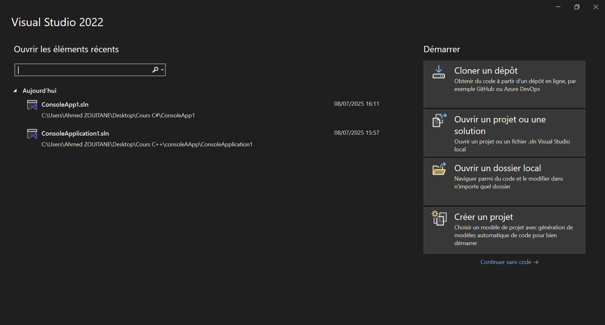
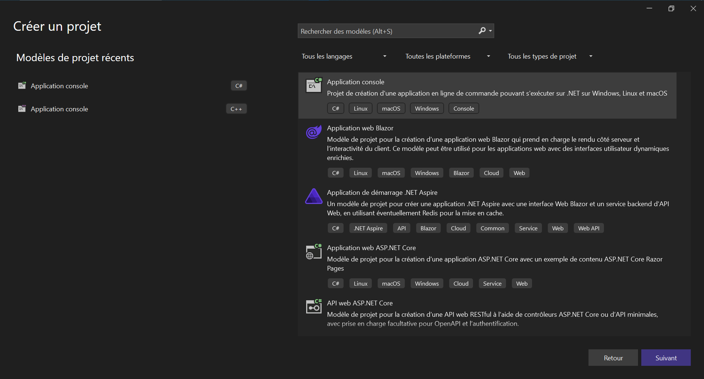

تمام! إليك **📘 Chapitre 2 : Premiers Pas avec C#** بالتفصيل 👇

---

# 🚀 Chapitre 2 : Premiers Pas avec C\#

---

## 🛠️ 1. Installation de l’environnement

### 🔷 Option 1 : Visual Studio (Windows uniquement – recommandé)

1. Va sur : [https://visualstudio.microsoft.com/fr/](https://visualstudio.microsoft.com/fr/)
2. Télécharge **Visual Studio Community 2022** (gratuit).
3. Lors de l’installation, sélectionne :

   * ✅ « Développement d’applications .NET Desktop »
   * ✅ « Développement avec Unity » *(si tu veux faire des jeux plus tard)*

### 🔷 Option 2 : Visual Studio Code (multiplateforme)

* Installe VS Code : [https://code.visualstudio.com/](https://code.visualstudio.com/)
* Installe le SDK .NET : [https://dotnet.microsoft.com/fr-fr/download](https://dotnet.microsoft.com/fr-fr/download)
* Extensions recommandées dans VS Code :

  * C# (par Microsoft)
  * .NET Install Tool

---

## 📦 2. Créer un premier projet C# (Console App)

### 🧰 Avec Visual Studio :

1. Clique sur **Créer un nouveau projet**.

2. Choisis **Application Console (.NET Core)**.

3. Donne un nom, par exemple `MonPremierProgramme`.
4. Clique sur **Créer**.

### ⚙️ Avec la ligne de commande (dotnet CLI) :

```bash
dotnet new console -n MonPremierProgramme
cd MonPremierProgramme
dotnet run
```

---

## 👨‍💻 3. Structure d’un programme C# simple

```csharp
using System;

class Program
{
    static void Main(string[] args)
    {
        Console.WriteLine("Bonjour tout le monde !");
    }
}
```

### 🔍 Explication :

| Élément               | Rôle                                                          |
| --------------------- | ------------------------------------------------------------- |
| `using System;`       | Importe les fonctionnalités de base du .NET (comme `Console`) |
| `class Program`       | Déclare une classe nommée `Program`                           |
| `static void Main`    | Point d’entrée du programme                                   |
| `Console.WriteLine()` | Affiche une ligne de texte dans la console                    |

---

## 🧪 4. Testons l’interaction avec l’utilisateur

```csharp
Console.WriteLine("Quel est ton nom ?");
string nom = Console.ReadLine();
Console.WriteLine("Enchanté, " + nom + " !");
```

---

## 📌 5. Compilation et exécution

### Si tu es sur Visual Studio :

* Clique sur le bouton **Démarrer (▶️)** pour exécuter.

### Si tu es en ligne de commande :

```bash
dotnet run
```

---

## ✅ Résumé du chapitre :

| Étape                         | Description                         |
| ----------------------------- | ----------------------------------- |
| Installation                  | Visual Studio ou VS Code + .NET SDK |
| Premier projet                | Console App                         |
| Point d’entrée                | `Main()`                            |
| Affichage                     | `Console.WriteLine()`               |
| Lecture de saisie utilisateur | `Console.ReadLine()`                |

